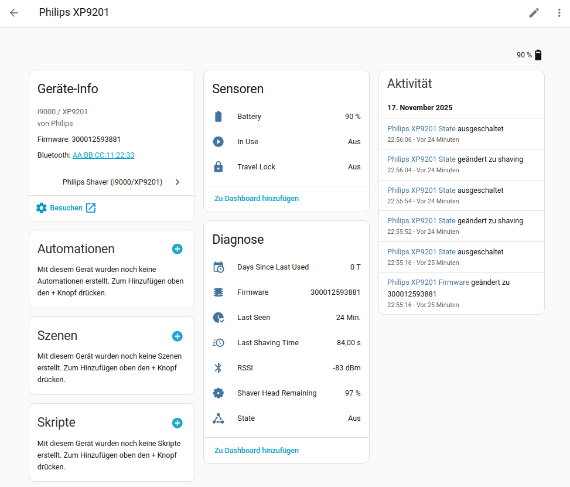

# Philips Shaver Integration for Home Assistant

[](https://github.com/hacs/integration)
[](https://github.com/mtheli/philips_shaver/releases)
[](LICENSE)

This is a custom component for Home Assistant to integrate **Philips Bluetooth-enabled shavers**, specifically tested with the **i9000 / XP9201 series**.



The integration connects to your shaver via **Bluetooth Low Energy (BLE)** to provide status, usage, and advanced telemetry data. It automatically detects the capabilities of your specific model during setup to only show relevant entities and employs a dual-connection approach:

1.  **Live Connection:** A persistent connection is maintained while the device is in range and active, offering instant updates for shaving status, motor metrics, and cleaning progress.
2.  **Poll Fallback:** A periodic poll (every 60 seconds) runs as a fallback to retrieve data when the device is in standby.

---

## Features

This integration creates a new device for your shaver and provides the following entities based on your device's hardware:

### Main Controls & Status
| Entity | Type | Description |
| :--- | :--- | :--- |
| **Activity** | Sensor | Current detailed status (`Off`, `Shaving`, `Charging`, `Cleaning`). |
| **Shaving Mode* | Select | Change the shaving intensity (e.g., `Sensitive`, `Normal`, `Intense`, `Custom`, `Foam`). |
| **Battery Level** | Sensor | The current battery charge level (`%`). |
| **Travel Lock** | Binary Sensor | Indicates if the travel lock is active. |

### Pressure, Motor & Coaching (S7000/S9000)
| Entity | Type | Description |
| :--- | :--- | :--- |
| **Pressure Value** | Sensor | Live pressure data from the sensor. |
| **Pressure State** | Sensor | Categorized feedback (`Too Low`, `Optimal`, `Too High`). |
| **Last Session Duration** | Light | Configure the LED ring colors for various pressure states. |
| **Motor Speed** | Sensor | Current motor speed in RPM (e.g., ~2200 RPM). |
| **Motor Current** | Sensor | Current motor power consumption in mA. |

### Usage & Maintenance
| Entity | Type | Description |
| :--- | :--- | :--- |
| **Last Session Duration** | Sensor | Duration of the last shaving session in seconds. |
| **Total Operating Time** | Sensor | Lifetime usage of the shaver. |
| **Days Since Last Used** | Sensor | Days elapsed since the last use. |
| **Head Remaining** | Sensor | The remaining life of the shaver head (`%`). |
| **Cleaning Progress** | Sensor | Progress of the cleaning cycle in `%` (if applicable). |


### Diagnostics
| Entity | Type | Description |
| :--- | :--- | :--- |
| **Last Seen** | Sensor | Time in minutes since the device was last reachable. |
| **RSSI** | Sensor | Bluetooth signal strength (`dBm`). |
| **Firmware** | Sensor | Installed firmware version. |

---

## Prerequisites

* A Home Assistant instance with the **Bluetooth integration** enabled and a working Bluetooth adapter.
* A compatible Philips Shaver (e.g., i9000/XP9201).
* *Exclusive Connection:* The shaver supports only one active connection at a time.
* *GroomTribe App:* You must unpair/remove the shaver from any other devices (especially smartphones with the manufacturer's "GroomTribe" app) before Home Assistant can connect.

---

## Installation

### HACS (Recommended)

1.  Go to **HACS** > **Integrations** in your Home Assistant UI.
2.  Click the three-dot menu in the top right and select **Custom repositories**.
3.  Add the URL to this repository and select the category **Integration**.
4.  Find the "Philips Shaver" integration and click **Install**.
5.  Restart Home Assistant.

### Manual Installation

1.  Copy the `custom_components/philips_shaver` directory from this repository into your Home Assistant `config/custom_components/` folder.
2.  Restart Home Assistant.

---

## Configuration (Pairing)

This integration requires that the shaver be **paired at the operating system (OS) level** of your Home Assistant host before you can add the integration in Home Assistant.

### Step 0: Clear Existing Connections (Crucial)

Before attempting to connect to Home Assistant, ensure the shaver is not connected to your phone.

1. Open the Bluetooth settings on your phone.
2. *Unpair / Forget* the Shaver.
3. If you used the *GroomTribe* app, ensure the device is removed there as well. The shaver will refuse a new connection if it is still "bonded" to a mobile app.

### Step 1: OS-Level Pairing with `bluetoothctl`

You must access the terminal of your Home Assistant server (e.g., via SSH or the "Terminal & SSH" add-on).

1.  Ensure your shaver is **turned on or placed on its charging stand**.
2.  Start the Bluetooth control tool:

    ```bash
    bluetoothctl
    ```

3.  Start scanning to find your shaver. It will likely appear as "Shaver" or similar. Note down its **MAC Address** (e.g., `AA:BB:CC:11:22:33`).

    ```bash
    scan on
    # ... Wait for the shaver to appear and note the address.
    scan off
    ```

4.  Perform the pairing with the shaver's MAC address. **Replace** the placeholder with your device's actual address.

    ```bash
    pair AA:BB:CC:11:22:33
    ```

5.  Trust the device to ensure stable auto-reconnection:

    ```bash
    trust AA:BB:CC:11:22:33
    ```

6.  Exit the tool:

    ```bash
    exit
    ```

The shaver is now paired with your host system.

### Step 2: Adding the Integration in Home Assistant

Once the OS-level pairing is complete, proceed to add the integration via the Home Assistant UI.

#### Method 1: Automatic Discovery (Recommended)

1.  Navigate to **Settings > Devices & Services**.
2.  If pairing was successful, Home Assistant should automatically discover the shaver and list it under **Discovered**.
3.  Click **Configure** on the discovered device card and confirm the setup by clicking **Submit**.

#### Method 2: Manual Setup

1.  If the shaver is not automatically discovered, click **+ Add Integration**.
2.  Search for "**Philips Shaver**" and select the integration.
3.  Enter the **MAC Address** (e.g., `AA:BB:CC:11:22:33`) you used in Step 1.
4.  Click **Submit**.

---

## Troubleshooting & Caveats

* *Connection Conflict*: If the integration fails to set up, ensure no smartphone is currently connected to the shaver.
* *ESPHome Bluetooth Proxy*: This integration requires a *direct active Bluetooth connection* for real-time telemetry. Therefore, it is not possible to use an ESPHome Bluetooth Proxy. The shaver must be within direct range of the Home Assistant host's Bluetooth adapter.
* *Stability:* Bluetooth signals are weak. Ensure your Home Assistant host is placed as close to the shaver's location as possible.

---

## BLE Protocol

The integration communicates directly via BLE — no cloud, no app required. All communication is fully local.

The shaver exposes multiple GATT services with individual characteristics for each data point (battery, motor, pressure, light ring, etc.). Data is read directly from these characteristics and live updates are received via GATT notifications.

For a detailed technical description of the BLE protocol including service UUIDs, characteristic reference, data formats, and capability flags, see [PROTOCOL.md](PROTOCOL.md).

## License

[MIT](LICENSE)