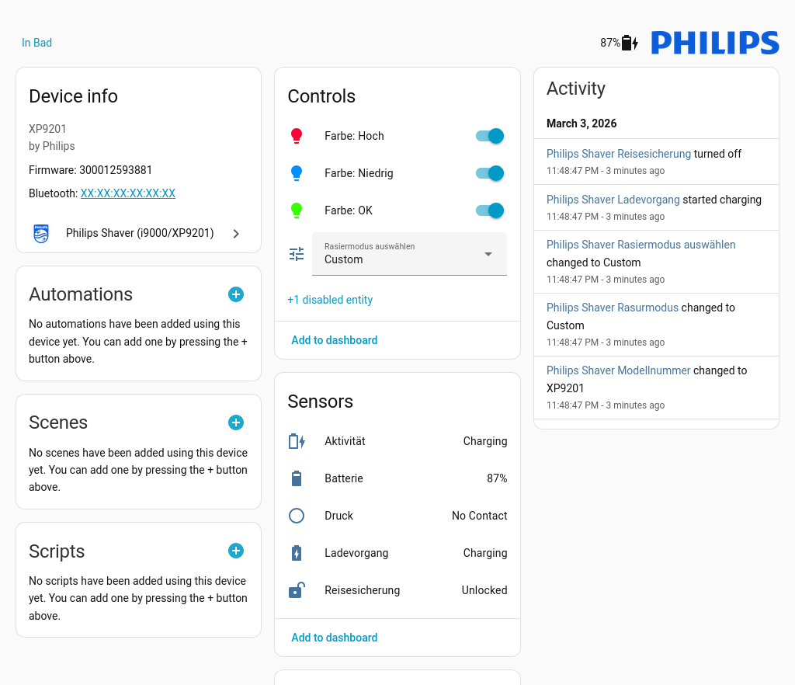
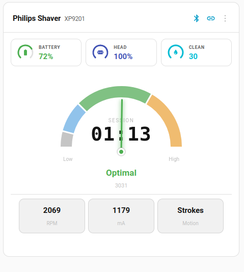
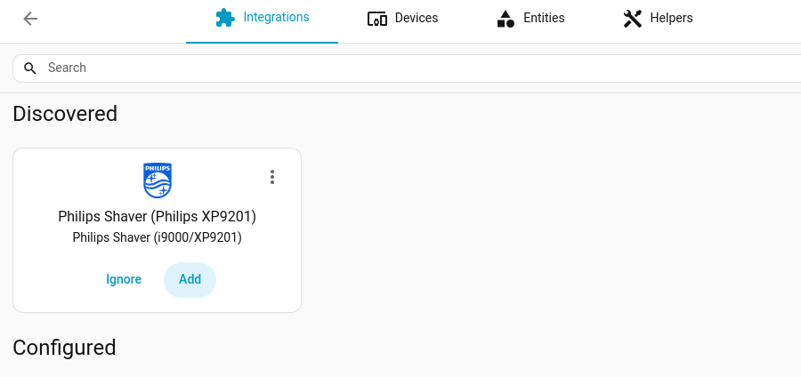
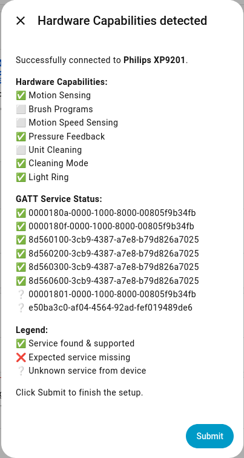
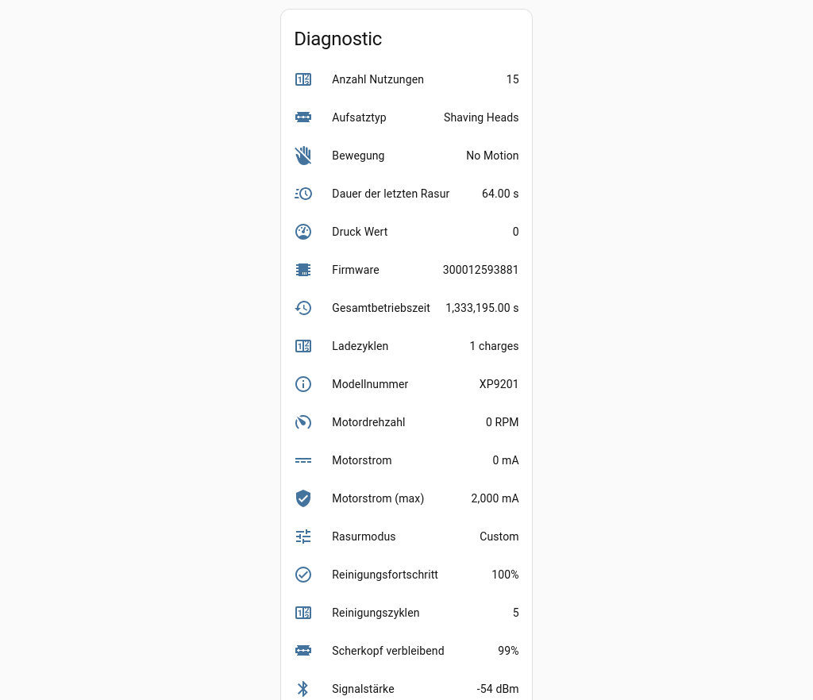

# Philips Shaver Integration for Home Assistant

[](https://github.com/hacs/integration)
[](https://github.com/mtheli/philips_shaver/releases)
[](LICENSE)

This is a custom component for Home Assistant to integrate **Philips Bluetooth-enabled shavers**.

### Tested Models

| Model | Type | Direct BLE | ESP32 Bridge | Tested by |
| :--- | :--- | :---: | :---: | :--- |
| [**Series 9000 / XP9201**](https://www.usa.philips.com/c-p/XP9201_88/i9000-prestige-wet-dry-electric-shaver-with-senseiq) | Shaver | :white_check_mark: | :white_check_mark: | Maintainer |
| [**Series 9000 / XP9400**](https://www.usa.philips.com/c-p/XP9400_89/i9000-prestige-ultra-wet-dry-electric-shaver-with-senseiq-pr) | Shaver | | :white_check_mark: | Community ([#3](https://github.com/mtheli/philips_shaver/issues/3)) |
| [**OneBlade 360 / QP4530**](https://www.usa.philips.com/c-p/QP4530_90/oneblade-360-with-connectivity-face) | Groomer | :white_check_mark: | :white_check_mark: | Maintainer |
| [**Series 7000 / S7887**](https://www.usa.philips.com/c-p/S7887_82/shaver-series-7000-wet-dry-electric-shaver) | Shaver | | :white_check_mark: | Community ([forum](https://community.home-assistant.io/t/philips-bluetooth-shaver-monitoring/858822/8)) |

Other BLE-enabled Philips shavers and groomers using the same GATT services may also work. The integration auto-detects available services and capabilities during setup — entities are only created for features your device supports.

The integration connects to your shaver via **Bluetooth Low Energy (BLE)** to provide status, usage, and advanced telemetry data. It automatically detects the capabilities of your specific model during setup to only show relevant entities.



Two connection methods are supported:

1.  **Direct Bluetooth** — connects from the HA host's Bluetooth adapter. Uses a persistent live connection with a poll fallback.
2.  **ESP32 BLE Bridge** — an ESP32 running ESPHome acts as a wireless BLE relay. Ideal when the shaver is out of Bluetooth range of the HA host. See the [ESP Bridge Setup Guide](docs/ESP_BRIDGE_SETUP.md) for instructions.

---

## Lovelace Card

A dedicated dashboard card is available: **[Philips Shaver Card](https://github.com/mtheli/philips_shaver_card)**



The card automatically switches between standby, shaving, charging, and cleaning modes with live pressure gauge, battery status, and session stats.

---

## Features

This integration creates a new device for your shaver and provides the following entities based on your device's hardware:

### Main Controls & Status
| Entity | Type | Description |
| :--- | :--- | :--- |
| **Activity** | Sensor | Current detailed status (`Off`, `Shaving`, `Charging`, `Cleaning`, `Locked`). |
| **Shaving Mode** | Select | Change the shaving intensity (e.g., `Sensitive`, `Normal`, `Intense`, `Custom`, `Foam`). |
| **Battery Level** | Sensor | The current battery charge level (`%`). |
| **Travel Lock** | Binary Sensor | Indicates if the travel lock is active. |
| **Charging** | Binary Sensor | Indicates if the shaver is currently charging. |
| **Light Ring** | Switch | Enable or disable the pressure coaching light ring. |
| **Handle Load Type** | Sensor | Detected head attachment (`Shaving Heads`, `Trimmer`, `Styler`, `Brush`, etc.). |
| **Motion** | Sensor | Live motion feedback (`No Motion`, `Small Circles`, `Large Strokes`). |

### Pressure, Motor & Coaching (S7000/S9000)
| Entity | Type | Description |
| :--- | :--- | :--- |
| **Pressure Value** | Sensor | Live pressure data from the sensor. |
| **Pressure State** | Sensor | Categorized feedback (`Too Low`, `Optimal`, `Too High`). |
| **Pressure Light Ring** | Light | Configure the LED ring colors for various pressure states. |
| **Light Ring Brightness** | Select | Adjust the pressure light ring brightness (`High`, `Medium`, `Low`). |
| **Motor Speed** | Sensor | Current motor speed in RPM (e.g., ~2200 RPM). |
| **Motor Current** | Sensor | Current motor power consumption in mA. |

### Speed Coaching (OneBlade)
| Entity | Type | Description |
| :--- | :--- | :--- |
| **Speed** | Sensor | Live grooming speed (0–200 raw). |
| **Speed Verdict** | Sensor | Real-time feedback (`Optimal`, `Too Slow`, `Too Fast`). Computed locally from speed and zone thresholds. |

### Usage & Maintenance
| Entity | Type | Description |
| :--- | :--- | :--- |
| **Last Session Duration** | Sensor | Duration of the last shaving session in seconds. |
| **Total Operating Time** | Sensor | Lifetime usage of the shaver. |
| **Days Since Last Used** | Sensor | Days elapsed since the last use. |
| **Charge Cycles** | Sensor | Total number of charge cycles. |
| **Remaining Shaves** | Sensor | Estimated number of shaves remaining based on battery level and usage history. |
| **Number of Uses** | Sensor | Total number of operational uses. |
| **Head Remaining** | Sensor | The remaining life of the shaver head (`%`). |
| **Blade Replacement** | Button | Confirm a blade replacement — resets the head remaining counter to 100%. |
| **Cleaning Progress** | Sensor | Progress of the cleaning cycle in `%` (if applicable). |
| **Cleaning Cycles** | Sensor | Total number of cleaning cycles. |
| **Cleaning Cartridge Remaining** | Sensor | Estimated remaining cleaning cartridge uses (accounts for fluid evaporation). |
| **Reset Cleaning Cartridge** | Button | Reset the cleaning cartridge counter after inserting a new cartridge. |

### Diagnostics
| Entity | Type | Description |
| :--- | :--- | :--- |
| **Last Seen** | Sensor | Time in minutes since the device was last reachable. |
| **RSSI** | Sensor | Bluetooth signal strength (`dBm`, direct BLE only). |
| **Shaver BLE** | Binary Sensor | BLE connection status to the shaver. |
| **ESP Bridge** | Binary Sensor | ESP32 bridge online status (ESP bridge only). |
| **Bridge Version** | Sensor | ESP bridge firmware version (ESP bridge only). |
| **Firmware** | Sensor | Installed firmware version (disabled by default). |
| **Model Number** | Sensor | Device model number (disabled by default). |

---

## Example Automations

See **[docs/AUTOMATIONS.md](docs/AUTOMATIONS.md)** for ready-to-use automation examples, including low battery alerts, smart plug charging, usage reminders, and maintenance notifications.

---

## Prerequisites

* A compatible Philips Shaver (see [Tested Models](#tested-models) above).
* **Either** a Home Assistant instance with the **Bluetooth integration** enabled and a working Bluetooth adapter, **or** an ESP32 running the [BLE bridge component](docs/ESP_BRIDGE_SETUP.md).
* *Exclusive Connection:* The shaver supports only one active connection at a time.
* *GroomTribe App:* You must unpair/remove the shaver from any other devices (especially smartphones with the manufacturer's [GroomTribe](https://www.philips.at/c-w/malegrooming/products/groomtribe-app.html) app) before Home Assistant can connect.

---

## Installation

### HACS (Recommended)

1.  Go to **HACS** > **Integrations** in your Home Assistant UI.
2.  Click the three-dot menu in the top right and select **Custom repositories**.
3.  Add the URL to this repository and select the category **Integration**.
4.  Find the "Philips Shaver" integration and click **Install**.
5.  Restart Home Assistant.

### Manual Installation

1.  Copy the `custom_components/philips_shaver` directory from this repository into your Home Assistant `config/custom_components/` folder.
2.  Restart Home Assistant.

---

## Configuration

The integration supports two connection methods:

| | Method | Best for |
| :--- | :--- | :--- |
| **[Option A](#option-a-direct-bluetooth-pairing)** | **Direct Bluetooth** | HA host is within Bluetooth range of the shaver |
| **[Option B](#option-b-esp32-ble-bridge)** | **ESP32 BLE Bridge** | Shaver is out of range — an ESP32 relays BLE over WiFi |

### Option A: Direct Bluetooth (Pairing)

This method requires that the shaver be **paired at the operating system (OS) level** of your Home Assistant host before you can add the integration.

### Step 0: Clear Existing Connections (Crucial)

Before attempting to connect to Home Assistant, ensure the shaver is not connected to your phone.

1. Open the Bluetooth settings on your phone.
2. *Unpair / Forget* the Shaver.
3. If you used the [GroomTribe](https://www.philips.at/c-w/malegrooming/products/groomtribe-app.html) app, ensure the device is removed there as well. The shaver will refuse a new connection if it is still "bonded" to a mobile app.

### Step 1: OS-Level Pairing with `bluetoothctl`

You must access the terminal of your Home Assistant server (e.g., via SSH or the "Terminal & SSH" add-on).

1.  Ensure your shaver is **turned on or placed on its charging stand**.
2.  Start the Bluetooth control tool:

    ```bash
    bluetoothctl
    ```

3.  Start scanning to find your shaver. It will likely appear as "Shaver" or similar. Note down its **MAC Address** (e.g., `AA:BB:CC:11:22:33`).

    ```bash
    scan on
    # ... Wait for the shaver to appear and note the address.
    scan off
    ```

4.  Perform the pairing with the shaver's MAC address. **Replace** the placeholder with your device's actual address.

    ```bash
    pair AA:BB:CC:11:22:33
    ```

5.  Trust the device to ensure stable auto-reconnection:

    ```bash
    trust AA:BB:CC:11:22:33
    ```

6.  Exit the tool:

    ```bash
    exit
    ```

The shaver is now paired with your host system.

### Step 2: Adding the Integration in Home Assistant

Once the OS-level pairing is complete, proceed to add the integration via the Home Assistant UI.

#### Method 1: Automatic Discovery (Recommended)

1.  Navigate to **Settings > Devices & Services**.
2.  If pairing was successful, Home Assistant should automatically discover the shaver and list it under **Discovered**.
3.  Click **Configure** on the discovered device card and confirm the setup by clicking **Submit**.

#### Method 2: Manual Setup

1.  If the shaver is not automatically discovered, click **+ Add Integration**.
2.  Search for "**Philips Shaver**" and select the integration.
3.  Enter the **MAC Address** (e.g., `AA:BB:CC:11:22:33`) you used in Step 1.
4.  Click **Submit**.

### Option B: ESP32 BLE Bridge

If your Home Assistant host is too far from the shaver for a direct Bluetooth connection, you can use an ESP32 as a wireless BLE bridge. The ESP32 connects to the shaver and relays data to HA over WiFi.

This is **not** a standard ESPHome Bluetooth Proxy — it is a custom component that handles the shaver's LE Secure Connections pairing and provides full read/write/subscribe access to all GATT characteristics.

A single ESP32 can bridge **multiple devices** (e.g. a shaver and an OneBlade simultaneously).

For the complete setup guide, see **[docs/ESP_BRIDGE_SETUP.md](docs/ESP_BRIDGE_SETUP.md)**.

---

## Troubleshooting & Caveats

* *Connection Conflict*: If the integration fails to set up, ensure no smartphone is currently connected to the shaver.
* *ESPHome Bluetooth Proxy*: The standard ESPHome Bluetooth Proxy does **not** work with this shaver because it requires LE Secure Connections pairing. Use the dedicated [ESP32 BLE Bridge](docs/ESP_BRIDGE_SETUP.md) instead.
* *Stability:* Bluetooth signals are weak. Ensure your HA host or ESP32 bridge is placed as close to the shaver's location as possible.

---

## BLE Protocol

The integration communicates directly via BLE — no cloud, no app required. All communication is fully local.

The shaver exposes multiple GATT services with individual characteristics for each data point (battery, motor, pressure, light ring, etc.). Data is read directly from these characteristics and live updates are received via GATT notifications.

For a detailed technical description of the BLE protocol including service UUIDs, characteristic reference, data formats, and capability flags, see [docs/PROTOCOL.md](docs/PROTOCOL.md).

For debug service actions (reading arbitrary BLE characteristics via Developer Tools), see [docs/ADVANCED.md](docs/ADVANCED.md).

## Screenshots

| Discovery | Capabilities | Device | Diagnostics |
| :---: | :---: | :---: | :---: |
|  |  |  |  |

## License

[MIT](LICENSE)