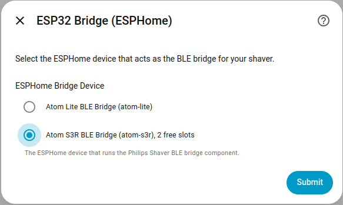
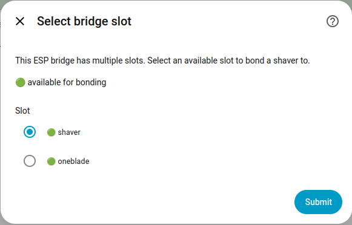
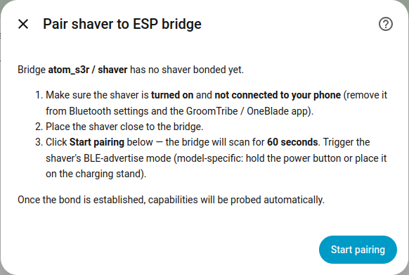
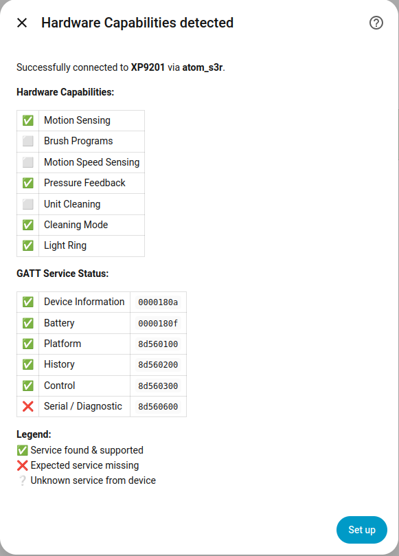

# ESP32 BLE Bridge Setup Guide

This guide explains how to set up an ESP32 as a Bluetooth Low Energy (BLE) bridge
for the Philips Shaver Home Assistant integration. The ESP32 connects to the shaver
via BLE and relays data to Home Assistant over WiFi, removing the need for direct
Bluetooth access from the HA host.

> [!IMPORTANT]
> This is a **dedicated ESPHome component**, not a standard
> [ESPHome Bluetooth Proxy](https://esphome.io/components/bluetooth_proxy.html).
> The standard Bluetooth Proxy does **not** support the LE Secure Connections
> pairing that Philips shavers require. If you already have an ESP32 running
> a Bluetooth Proxy, you still need to flash this custom component — the proxy
> alone will fail with `ESP_GATT_CONN_FAIL_ESTABLISH`.

## Tested Hardware

| Board | Status |
|-------|--------|
| [M5Stack Atom Lite](https://docs.m5stack.com/en/core/ATOM%20Lite) (ESP32-PICO) | Confirmed (maintainer, [#3](https://github.com/mtheli/philips_shaver/issues/3)) |
| Lolin D32 (ESP32) | Confirmed ([forum](https://community.home-assistant.io/t/philips-bluetooth-shaver-monitoring/858822/)) |
| [M5Stack NanoC6](https://docs.m5stack.com/en/core/M5NanoC6) (ESP32-C6) | Confirmed ([#7](https://github.com/mtheli/philips_shaver/issues/7)) |
| [M5Stack AtomS3R](https://docs.m5stack.com/en/core/AtomS3R) (ESP32-S3) | Confirmed (maintainer) |
| [M5Stack AtomS3U](https://docs.m5stack.com/en/core/AtomS3U) (ESP32-S3) | Confirmed ([#6](https://github.com/mtheli/philips_shaver/issues/6), v0.13.0+) |
| ESP32-S3 DevKitC-1 | Should work (same SoC) |
| Generic ESP32-DevKit | Should work (same SoC) |
| ESP32-C3 | Untested — BLE stack should be compatible |

## Prerequisites

- **ESP32 board** — see [Tested Hardware](#tested-hardware) above
- **ESPHome** — installed as Home Assistant add-on or standalone
- **Philips Shaver or OneBlade** — see [Tested Models](../README.md#tested-models)

## Setup overview

The bridge supports two configuration paths. Both run on the same standalone
component — they only differ in how the shaver gets associated with the bridge:

- **Auto-Discovery** ⭐ — no MAC in YAML. The ESP scans for the universal
  Philips Shaver Platform Service UUID (`8d560100`) and bonds with the device
  you put into pair-mode via the HA setup dialog. The bonded MAC persists in
  NVS so the bridge auto-reconnects on subsequent boots. Recommended for all
  new setups — works for every supported model and removes the need to look
  up the MAC up front.
- **Fixed MAC** — set `mac_address:` directly in the `philips_shaver:` entry.
  The bridge connects to that MAC automatically on boot, no HA pair-dialog
  needed. Useful when you already know the MAC and want deterministic
  slot-to-shaver mapping from YAML (e.g. multi-bridge setups where each
  ESP slot must be tied to a specific device).

<sub>⭐ marks the preferred path for new setups.</sub>

The walkthrough below uses Auto-Discovery as the primary flow, with the Fixed
MAC variant called out where the steps differ.

> [!NOTE]
> A third configuration via an external `ble_client:` block exists for
> backwards compatibility with older configs.
> See [Legacy: external `ble_client:`](#legacy-external-ble_client) at the
> bottom — new setups should not use it; it offers no advantage over Fixed
> MAC.

## Step 1: Create the ESPHome Configuration

Use the template [`esphome/atom-lite.yaml`](../esphome/atom-lite.yaml) (Atom
Lite, two devices) or [`esphome/esp32-generic.yaml`](../esphome/esp32-generic.yaml)
(generic ESP32 dev board, single device) as a starting point. Copy it to your
ESPHome configuration directory and customize.

If you already have an ESP32 running other components (e.g. `bluetooth_proxy`),
you can add the Philips Shaver component to your existing config instead of
using the template.

### Required changes

1. **Board type** — change to your board if different from the template:
   ```yaml
   esp32:
     board: m5stack-atom   # or m5stack-atoms3, esp32dev, esp32-s3-devkitc-1, …
   ```

2. **Secrets** — create or update your `secrets.yaml` with:
   ```yaml
   api_encryption_key: "<generate with `esphome wizard`>"
   ota_password: "<your OTA password>"
   wifi_ssid: "<your WiFi SSID>"
   wifi_password: "<your WiFi password>"
   fallback_password: "<fallback AP password>"
   ```

### What you should NOT change

- **Framework**: must be `esp-idf` (not Arduino) — required for configurable BLE limits
- **sdkconfig options**: `CONFIG_BT_GATTC_MAX_CACHE_CHAR` and
  `CONFIG_BT_GATTC_NOTIF_REG_MAX` — the shaver has ~66 GATT attributes and
  we subscribe to 17+ characteristics. Use `100`/`30` for a single device,
  `160`/`50` for two devices (see [Multi-Device Setup](#multi-device-setup) below)
- **API flags**: `custom_services: true` and `homeassistant_services: true` —
  required for the bridge component to register its services
- **`max_connections`** under `esp32_ble:` — `4` for single device, `5` for two
  devices (`bluetooth_proxy` uses 3 slots + 1 slot per shaver)
- **external_components**: the component is loaded directly from this GitHub
  repository. The `refresh: 0s` setting ensures the latest code is fetched on
  every build

### Minimal config snippets

If you're adding this to an existing ESPHome config, these are the blocks you
need. The shared infrastructure (framework, api, ble) is identical — only the
`philips_shaver:` entry differs between the two paths.

#### Shared infrastructure

```yaml
esp32:
  framework:
    type: esp-idf
    sdkconfig_options:
      CONFIG_BT_GATTC_MAX_CACHE_CHAR: "100"
      CONFIG_BT_GATTC_NOTIF_REG_MAX: "30"

api:
  custom_services: true
  homeassistant_services: true

esp32_ble:
  io_capability: none
  max_notifications: 30
  max_connections: 4

esp32_ble_tracker:
  scan_parameters:
    active: true

external_components:
  - source:
      type: git
      url: https://github.com/mtheli/philips_shaver
      ref: main
      path: esphome/components
    components: [philips_shaver]
    refresh: 0s
```

#### Auto-Discovery ⭐ (preferred)

No MAC in YAML — the shaver is paired through the HA setup dialog and the
identity is persisted to NVS:

```yaml
philips_shaver:
  - bridge_id: "shaver"
    connected:
      name: "Shaver Connected"
```

#### Fixed MAC

Set `mac_address:` to pin the bridge to a specific shaver. The bridge connects
on boot without going through the HA pair-dialog:

```yaml
philips_shaver:
  - bridge_id: "shaver"
    mac_address: "XX:XX:XX:XX:XX:XX"   # <-- your shaver's MAC
    connected:
      name: "Shaver Connected"
```

To find the MAC, the shaver advertises when powered on or placed on the
charging stand:

- **Home Assistant Bluetooth**: Settings → Devices & Services → Bluetooth →
  look for "Philips XP9201" / "Philips XP9400" / similar
- **nRF Connect** ([Android](https://play.google.com/store/apps/details?id=no.nordicsemi.android.mcp) / [iOS](https://apps.apple.com/app/nrf-connect-for-mobile/id1054362403)):
  scan and filter for "Philips"
- **ESPHome logs**: any ESP32 with `esp32_ble_tracker` enabled will print
  `Found device … Name: 'Philips XP9201'`

## Step 2: Flash the ESP32

1. Open the **ESPHome Dashboard** in Home Assistant
2. Add a new device or upload your customized YAML
3. Click **Install** and choose your flashing method:
   - USB for first-time flash
   - OTA for subsequent updates
4. Wait for the build and flash to complete

> [!NOTE]
> Switching between Arduino and ESP-IDF framework requires a full clean build
> ("Clean Build Files" in the ESPHome dashboard before flashing).

## Step 3: Verify the Bridge Boots

After flashing, the ESP32 boots and starts. The expected boot log depends on
which configuration path you chose.

**Auto-Discovery (no MAC, no stored bond)** — the bridge does **not** initiate
any connection on its own; it waits for the HA setup flow to arm pair-mode:

```
[I][philips_shaver:062]: Services registered (bridge_id: 'shaver')
[I][philips_shaver.shaver]: No identity in flash — UUID scan mode (waiting for pair-mode)
```

The `No identity in flash — UUID scan mode` line confirms the bridge is up and
waiting for pair-mode. In multi-bridge setups, the log tag becomes
`philips_shaver.<bridge_id>` (e.g. `philips_shaver.shaver`,
`philips_shaver.oneblade`) so each bridge's lines are identifiable in the
stream and `logger:` filters can target a single bridge by suffix.

**Fixed MAC** — the bridge logs the configured MAC and starts connecting
immediately:

```
[I][philips_shaver:062]: Services registered (bridge_id: 'shaver')
[D][esp32_ble_tracker:726]:   Name: 'Philips XP9201'
[I][esp32_ble_client:111]: [0] [XX:XX:XX:XX:XX:XX] 0x01 Connecting
[I][esp32_ble_client:326]: [0] [XX:XX:XX:XX:XX:XX] Connection open
[I][philips_shaver:061]: Connected to shaver
[I][esp32_ble_client:435]: [0] [XX:XX:XX:XX:XX:XX] Service discovery complete
[D][esp32_ble_client:547]: [0] [XX:XX:XX:XX:XX:XX] auth success type = 1 mode = 9
```

The key line is **`auth success type = 1`** — this confirms LE Secure
Connections pairing succeeded. The `mode` value depends on your shaver model
(9 = Just Works, 13 = Numeric Comparison with MITM). Both are valid.

## Step 4: Add the Integration in Home Assistant

1. Install the **Philips Shaver** integration in Home Assistant
   (via [HACS](../README.md#installation) or manually)
2. Go to **Settings > Devices & Services > + Add Integration** and search for
   **Philips Shaver**
3. Select **"ESP32 Bridge (ESPHome)"** → pick your ESP from the list. The
   picker shows each bridge with the count of free slots so you can tell
   at a glance which one still has capacity:

   

4. If the chosen ESP runs multiple `philips_shaver:` slots, a second dialog
   asks which slot to bond to. Available (unbonded) slots are marked
   🟢, already-configured ones ✅:

   

What happens next depends on the configuration path:

**Auto-Discovery** — the slot is empty (`pair_capable=true`), so the
integration goes straight to the **"Pair shaver to ESP bridge"** dialog. It
walks you through getting the shaver advertising and starts a 60 s scan when
you click **Start pairing**:



> [!IMPORTANT]
> If you have multiple Philips devices nearby, only put the one you want to
> bond into pair-mode — the bridge bonds to the first matching device, period.

**Fixed MAC** — the slot already has an identity from YAML
(`pair_capable=false`), so the pair dialog is skipped and the integration
goes straight to capability detection. Make sure the shaver is reachable
(within range, not on the charger) on first setup so the bridge can complete
GATT discovery and the SMP exchange on this first connection.

**Fixed MAC** also shows an interim **Connection via ESP32 Bridge** page
first, summarising the bridge state (component version, BLE Connected, bond
status, MAC). Click **Read capabilities** there to start the probe.
Auto-Discovery skips this page on purpose — for a fresh, unbonded slot the
"BLE Disconnected / Paired: No" rows would look like an error, so the flow
goes straight from `Start pairing` to the capabilities probe.

Both paths end at the **Hardware Capabilities detected** page, which lists
the supported features and GATT services for review:



Click **Set up** to finish — the shaver appears as a sub-device of the ESP32.
A red ❌ next to a GATT service means the bridge couldn't read it; that is
fine for optional services (e.g. `Serial / Diagnostic` on devices that don't
expose it) but a missing core service (Platform / History / Control) is a
sign of an interrupted connection — retry from the integration.

### Expected pair-mode logs

A successful pair-mode run on the ESP looks like this (XP9201 paired to an
AtomS3R):

```
[I][philips_shaver.shaver:1111]: Pair-mode armed for 60s
[I][philips_shaver.shaver:277]:  Found Philips shaver via UUID at AA:BB:CC:DD:EE:FF (pair-mode)
[I][esp32_ble_client:125]:       [0] [AA:BB:CC:DD:EE:FF] 0x01 Connecting
[I][esp32_ble_client:343]:       [0] [AA:BB:CC:DD:EE:FF] Connection open
[I][philips_shaver.shaver:077]:  SMP security params applied (io_cap=DisplayYesNo, auth=0x2D)
[I][philips_shaver.shaver:206]:  Connected to shaver (AA:BB:CC:DD:EE:FF)
[I][esp32_ble_client:463]:       [0] [AA:BB:CC:DD:EE:FF] Service discovery complete
[D][philips_shaver.shaver:337]:  Probe read issued for handle 0x0051 — waiting on result
[I][philips_shaver.shaver:375]:  Device name: Philips XP9201
[I][philips_shaver.shaver:398]:  Probe needs encryption (status=5, fresh pair) — initiating
[I][esp32_ble_client:570]:       [0] [AA:BB:CC:DD:EE:FF] auth complete addr: AA:BB:CC:DD:EE:FF
[D][esp32_ble_client:575]:       [0] [AA:BB:CC:DD:EE:FF] auth success type = 1 mode = 9
[I][philips_shaver.shaver:320]:  Bonded — saving identity AA:BB:CC:DD:EE:FF, switching to MAC mode
[I][philips_shaver.shaver:591]:  Pair complete — disarming pair-mode (identity_source=nvs)
[I][philips_shaver.shaver:611]:  Auth complete — retrying probe read on handle 0x0051
[I][philips_shaver.shaver:389]:  Probe OK — connection encrypted, ready
```

The two key milestones are **`Bonded — saving identity`** (NVS write — the
shaver will reconnect on its own across reboots from now on) and
**`Probe OK — connection encrypted, ready`** (the bridge fires its `ready`
event and HA's "Read capabilities" can proceed).

The probe-read pattern (issue read with `AUTH_REQ_NONE`, get
`status=5/INSUF_ENCR`, initiate encryption, retry on `AUTH_CMPL`) is the
[lazy-encrypt fix from v1.7.0](../esphome/CHANGELOG.md) — it works around a
Bluedroid race on ESP32-S3 where proactive `set_encryption()` could nuke a
fresh bond.

After `ready`, HA reads the standard GATT chars (battery `0x2A19`,
model number `0x2A24`, the Philips Platform/History/Control services) — so
expect a burst of `Read … (n bytes)` lines on the next ~1 s of log.

If HA is slow to subscribe (e.g. config flow still in progress), you'll see
the bridge re-fire the `ready` event every 15 s:

```
[I][philips_shaver.shaver:097]: BLE connected, no subscriptions — re-firing ready
```

This is the post-OTA / post-reboot recovery mechanism, self-terminating once
HA subscribes.

### Re-pairing a different shaver

The normal way to bond a different shaver to a slot is just to **remove the
integration entry** in HA (Settings → Devices & Services → Philips Shaver →
⋮ → Delete). The integration's `async_remove_entry` hook fires
`esphome.<atom_name>_ble_unpair_<bridge_id>` automatically — the bridge
clears its NVS identity, removes the BLE bond, and drops back to UUID-scan
mode. Adding the integration again then routes through the pair-dialog for
the new shaver.

> [!IMPORTANT]
> BLE pairing is bidirectional — clearing the bond on the bridge only
> removes one half. The **shaver itself still considers itself paired** to
> the bridge until you clear it on the device side too. Without that, the
> next pair-mode attempt may fail with `pair_failed reason=auth_max_failures`
> (the shaver rejects fresh-pair attempts because it still has a bond
> entry). The clear-on-device procedure is model-specific (S7000 series,
> i9000 / S-series, OneBlade 360) — see the [Unpairing Guide](UNPAIRING.md)
> for the exact button sequence.

For Fixed MAC slots, removing the entry only drops the BLE bond — the YAML
target stays, so the bridge re-bonds to the same MAC on the next connect.
To switch the MAC, edit the YAML and re-flash.

If the auto-unpair didn't fire (e.g. the bridge was unreachable when the
entry was removed, or the firmware is older than v1.8.0 and doesn't have
`ble_unpair` registered yet), call the service manually from
**Developer Tools → Services**:

```
esphome.<atom_name>_ble_unpair_<bridge_id>
```

The bridge then runs the unpair sequence shown in
[Expected unpair logs](#expected-unpair-logs) below.

### Expected unpair logs

```
[I][philips_shaver.shaver:888]:  Unsubscribing from 8d56010a-3cb9-4387-a7e8-b79d826a7025 (handle 0x0037)...
[I][philips_shaver.shaver:888]:  Unsubscribing from 8d560104-3cb9-4387-a7e8-b79d826a7025 (handle 0x0028)...
[I][philips_shaver.shaver:888]:  ...                                                                       (one line per subscription, ~17–19 total)
[I][philips_shaver.shaver:1149]: Bond removed
[W][philips_shaver.shaver:145]:  Identity cleared (was AA:BB:CC:DD:EE:FF) — back to UUID-scan mode
[I][philips_shaver.shaver:199]:  Disabling BLE client.
[I][philips_shaver.shaver:1159]: Unpair initiated — drain window 2000ms, awaiting `unpaired` emit
[D][esp-idf:000][BTU_TASK]:      hci cmd send: disconnect: hdl 0x1, rsn:0x13
[D][esp32_ble_client:211]:       [0] [] ESP_GATTC_CLOSE_EVT
[I][philips_shaver.shaver:135]:  Unpair drain complete
```

The 2 s drain window between `Unpair initiated` and `Unpair drain complete`
gives any in-flight GATT writes time to land before the BLE link is torn
down. The bridge fires the `unpaired` event after the drain — HA waits on
that event before re-arming pair-mode for the next shaver.

## Multi-Device Setup

A single ESP32 can bridge **multiple** Philips devices simultaneously (e.g.
a shaver and a OneBlade). Each gets its own `philips_shaver:` entry with a
unique `bridge_id`. Each slot can use either path independently —
Auto-Discovery, Fixed MAC, or a mix:

```yaml
philips_shaver:
  - bridge_id: "shaver"
    # Auto-Discovery — paired via HA dialog

  - bridge_id: "oneblade"
    mac_address: "XX:XX:XX:XX:XX:XX"   # Fixed MAC — pinned from YAML
```

### Key differences from single-device

| Setting | Single device | Two devices |
|---------|--------------|-------------|
| `CONFIG_BT_GATTC_MAX_CACHE_CHAR` | `"100"` | `"160"` |
| `CONFIG_BT_GATTC_NOTIF_REG_MAX` | `"30"` | `"50"` |
| `max_notifications` | 30 | 50 |
| `max_connections` | 4 | 5 |
| `philips_shaver` entries | 1 | 2 (each with unique `bridge_id`) |

The `bridge_id` is **required** when using multiple instances — the ESP will
refuse to compile without it. It serves as a suffix for service names
(e.g., `ble_pair_mode_shaver`, `ble_read_char_oneblade`) so HA can address
each slot separately. The same label appears in the HA bridge picker.

Each slot has its own bond storage in NVS, so the two devices are completely
independent — pair, unpair, or re-pair one without affecting the other.

A full example is available in
[`esphome/atom-lite.yaml`](../esphome/atom-lite.yaml).

> [!NOTE]
> Each device should only be connected via **one** path — either Direct BLE
> or ESP Bridge, not both simultaneously. See the
> [Unpairing Guide](UNPAIRING.md) if the device is currently paired with your
> phone or HA host.

## Troubleshooting

### Unpairing before switching to the ESP32 Bridge

The shaver can only be paired with **one device at a time**. If it is currently
paired with your phone or your HA host via Direct Bluetooth, you must unpair it
first before the ESP32 bridge can connect.

Follow the [Unpairing Guide](UNPAIRING.md) for step-by-step instructions.

### Pair-mode times out without finding the shaver

- The shaver only advertises while powered on or in pair-mode. Switch it on
  (or, if it was previously bonded, put it into pair-mode — see the
  [Unpairing Guide](UNPAIRING.md) for the model-specific procedure), then
  click **Start pairing**
- Distance: keep the shaver within ~1 m of the ESP during pair-mode
- Make sure no phone has an active connection to the shaver — close the
  [GroomTribe](https://www.philips.at/c-w/malegrooming/products/groomtribe-app.html)
  app or disable Bluetooth on the phone

### Pairing fails (no `auth success` in logs)

- Ensure the shaver is **not connected to your phone** (disconnect Bluetooth or
  close the GroomTribe app)
- The shaver must be **powered on or in pair-mode**
- Pairing is handled automatically on connect — no manual button press required
  on the ESP side
- The SMP parameters in the component work across all ESP32 boards

### "No ESPHome devices found" in HA config flow

- The ESP32 must be fully set up and connected to Home Assistant via the
  ESPHome integration first
- Check **Settings > Devices & Services > ESPHome** — your device should be
  listed there
- If using a fresh ESPHome install, wait for the device to come online after
  flashing

### "Failed to connect to the shaver" during setup (Fixed MAC)

- The ESP32 must be in range and the shaver must be reachable (powered on,
  not on the charger) on first setup
- Check ESPHome logs for connection errors or disconnect events
- For Auto-Discovery slots, this error means the pair-mode flow timed out —
  retry from the integration's **Reconfigure** option

### No data after OTA update

After an OTA flash, the ESP32 reboots and reconnects to the shaver via BLE
before Home Assistant re-establishes the API stream (~5-10 seconds). The
bridge automatically re-fires the "ready" event every 15 seconds until HA
subscribes to notifications. If data still doesn't flow:

- **Reload the integration** in HA (Settings > Devices & Services >
  Philips Shaver > ⋮ > Reload)
- Check ESPHome logs for `BLE connected, no subscriptions — re-firing ready`
- Check HA logs for `ESP bridge rebooted — forcing re-setup`

### ESP32 disconnects frequently

- Place the ESP32 within ~5m of the shaver for a stable BLE connection
- The bridge will automatically reconnect after disconnections
- WiFi and BLE coexistence is managed automatically (`balanced` mode)

## Architecture

```
┌──────────┐   BLE    ┌─────────┐  WiFi/API  ┌──────────────────┐
│  Shaver  │◄────────►│  ESP32  │◄──────────►│ Home Assistant   │
│          │  paired  │  Bridge │  ESPHome   │ Philips Shaver   │
└──────────┘          └─────────┘  services  │ Integration      │
                                             └──────────────────┘
```

- **ESP32 → HA**: fires `esphome.philips_shaver_ble_data`,
  `esphome.philips_shaver_ble_status`, and `esphome.philips_shaver_ble_services`
  events with characteristic UUID and hex payload
- **HA → ESP32**: calls ESPHome services (`ble_read_char`, `ble_subscribe`,
  `ble_write_char`, `ble_unsubscribe`, `ble_pair_mode`, `ble_unpair`,
  `ble_get_info`, …) with service and characteristic UUIDs
- **Diagnostics**: `ble_get_info` returns bridge version, uptime, free heap,
  pairing status, mode, identity source, and active subscription count — used
  during config flow and for troubleshooting

## Service & event reference

The bridge exposes its functionality to Home Assistant as a small set of
ESPHome services (`ble_read_char`, `ble_subscribe`, `ble_pair_mode`, …) and
fires events back (`esphome.philips_shaver_ble_data`,
`esphome.philips_shaver_ble_status`). For the full per-service signatures,
the event field reference, the operation-mode table (`external` vs
`standalone`), and the `identity_source` semantics, see
**[ESP32_PROTOCOL.md](ESP32_PROTOCOL.md)**.

For protocol-level details on the BLE side (which GATT characteristics,
payload formats, capability flags), see [BLE_PROTOCOL.md](BLE_PROTOCOL.md).

---

<details>
<summary><strong>Legacy: external <code>ble_client:</code></strong> (kept for backwards compatibility)</summary>

Earlier versions of this component required an external `ble_client:` block
that the `philips_shaver:` entry then referenced via `ble_client_id:`. This
configuration is still accepted so existing YAMLs keep working, but it offers
no advantage over [Fixed MAC](#fixed-mac) above — both pin the shaver by MAC
and connect on boot — while requiring an extra block. **New setups should use
Auto-Discovery or Fixed MAC.**

```yaml
ble_client:
  - mac_address: "XX:XX:XX:XX:XX:XX"   # <-- your shaver's MAC
    id: shaver_ble
    auto_connect: true

philips_shaver:
  - ble_client_id: shaver_ble
    bridge_id: "shaver"
```

Pairing on this path happens once via the GPIO button wired in the template
YAMLs (the `on_press` action calls `id(shaver_ble).pair();`) — put the shaver
into pair-mode (see the [Unpairing Guide](UNPAIRING.md) for the model-specific
procedure), then press the ESP's button.
The bond persists in NVS across reboots.

To migrate to Fixed MAC, drop the `ble_client:` block, replace
`ble_client_id: shaver_ble` with `mac_address: "XX:XX:XX:XX:XX:XX"`, and
re-flash. The bond persists across the migration since it lives on the
ESP's NVS, not in the YAML.

</details>
